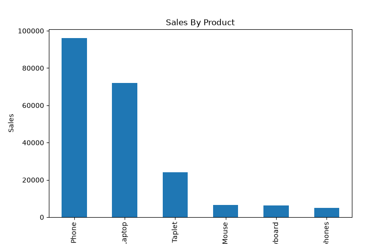
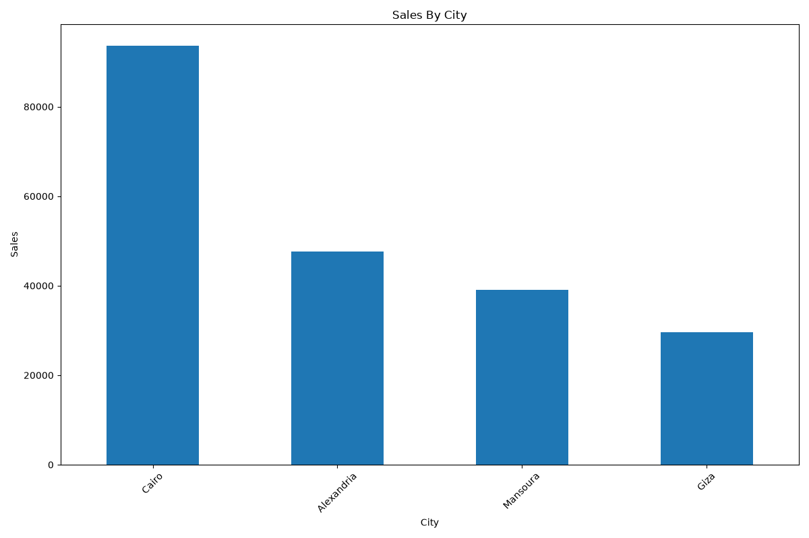

# E-Commerce Analysis Project

## Project Overview

This project analyzes e-commerce sales data using Python, Pandas, and Matplotlib.

The goal is to generate business insights from sales transactions and identify top-performing products, categories, and cities.

---

## Tools Used

* Python
* Pandas
* Matplotlib

---

## Features

* Calculate Total Sales Revenue
* Calculate Average Order Value
* Find Best Selling Product
* Find Worst Selling Product
* Find Best Category
* Find Worst Category
* Find Best City
* Find Worst City
* Display Top 5 Products by Sales
* Generate Sales Visualizations

---

## Project Files

* `analysis.py` → Main analysis script
* `ecommerce_data.csv` → Dataset
* `product_sales.png` → Product sales chart
* `city_sales.png` → City sales chart

---

## Sample Analysis

* Total Sales Revenue
* Average Order Value
* Product Performance Analysis
* Category Performance Analysis
* City Performance Analysis
* Top 5 Products by Sales

---

## Visualizations

### Product Sales Chart



### City Sales Chart



---

## How to Run

1. Install required libraries:

```bash
pip install pandas matplotlib
```

2. Run the script:

```bash
python analysis.py
```

---

## Output

The project generates:

* Business summary report
* Product sales chart
* City sales chart
